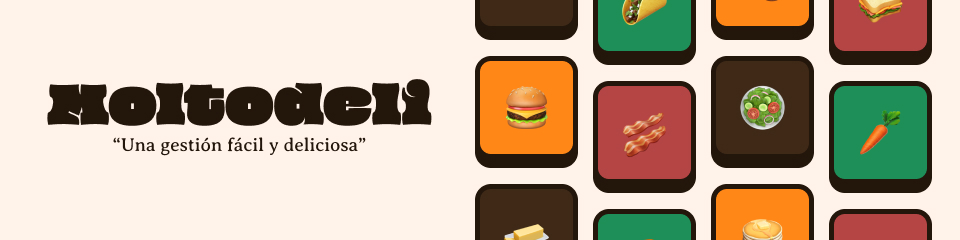

## Sobre Moltodeli

Estamos desarrollando una plataforma con la que podrás gestionar los pedidos de tu restaurante de una forma rápida y deliciosa, cabe recalcar que este proyecto es para una tarea asignada en mi instituto, por lo cual esta ampliamente documentada.

No obstante si deseas usar el código para uso comercial no olvides comunicarte conmigo antes de hacerlo, dicho esto puedes empezar a leer todo el código.

## Equipo detrás de Moltodeli

Las personas detrás de moltodeli son dos a quienes les estamos profundamente agradecidos por su constante participación.

- [@damkandev](https://github.com/damkandev) - Programador Principal Base de Frontend y API
- [@kanna](https://github.com/bony24) - Programadora de la API en Python

Estas personas han contribuido principalmente al proyecto de Moltodeli y que su realización pueda ser efectiva, puedes echarle un ojo a sus perfiles de github.

## Iniciar el proyecto

Para iniciar el proyecto tienes que tener instalado los siguiente: [Python 3.11](https://www.python.org/), [Node 18](https://nodejs.org/es), [Laragon (Recomendación)](https://laragon.org/download/index.html) y [DBeaver (Recomendación)](https://dbeaver.io/).

Luego de haber instalado las herramientas anteriormente mencionadas, tendrás que clonar el repositorio haciendo uso de:

```git
git clone https://github.com/damkandev/moltodeli
```

Luego de clonar el repositorio, entraras en el directorio haciendo uso de:

```console
cd moltodeli
cd web
```

Una vez dentro de Moltodeli pondremos lo siguiente en la terminal para terminar de instalar la parte del frontend:

```console
npm install
```

Y luego iremos al diretorio de api, si has seguido todos los pasos hasta acá, tendrás que copiar y pegar los siguientes comandos.

```console
cd ..
cd cd .\api\
pip install requirements.txt
```

una vez lo hagamos, abriremos dos terminales, una en el directorio de api y otra en la web y pondremos en la terminal dentro de web.
